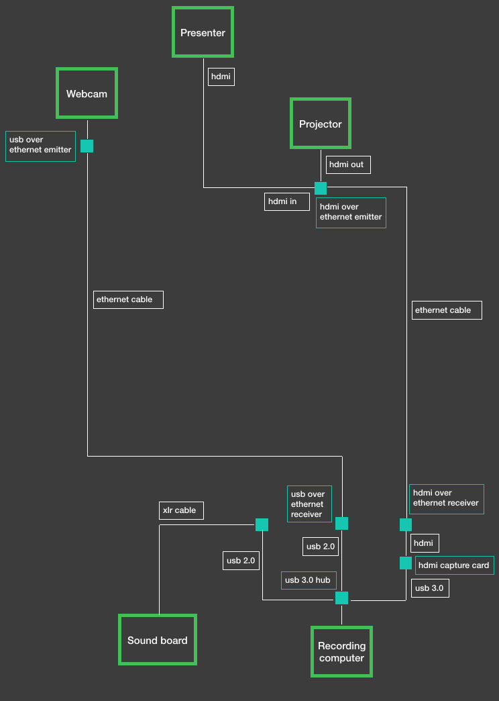
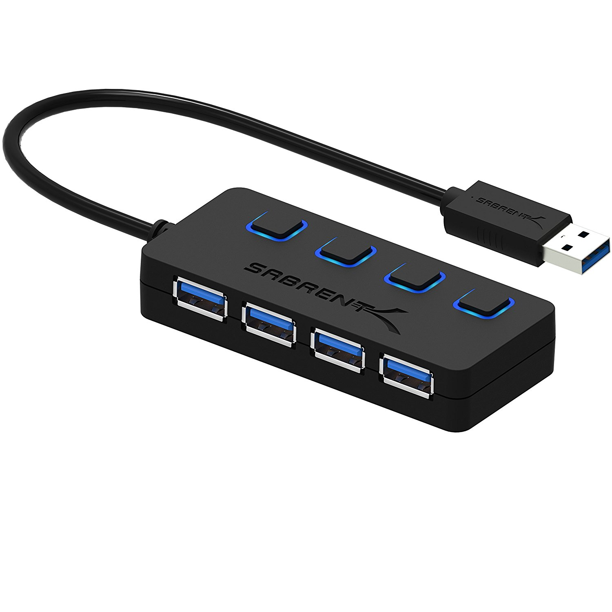
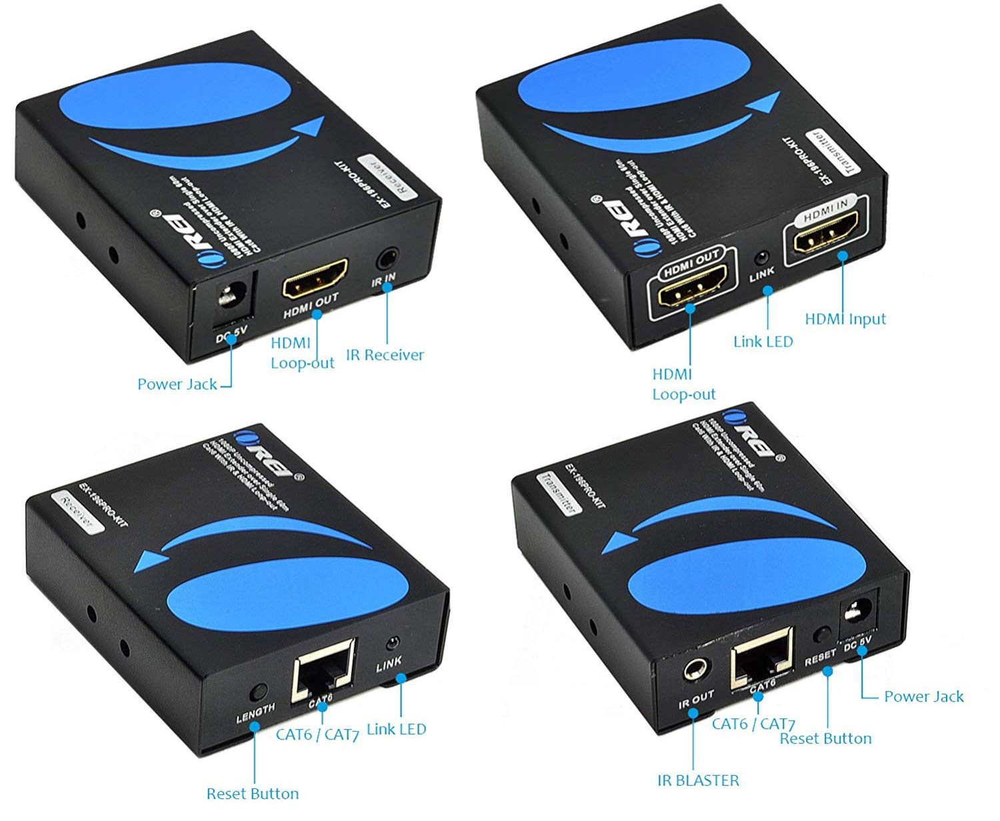
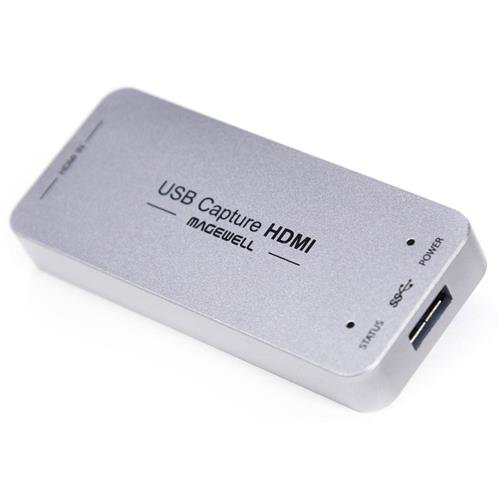
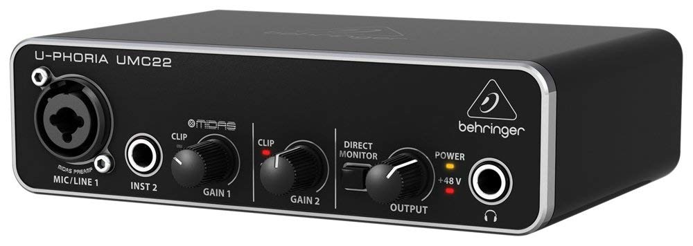
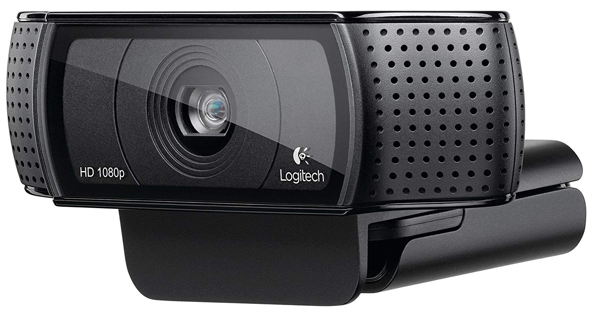
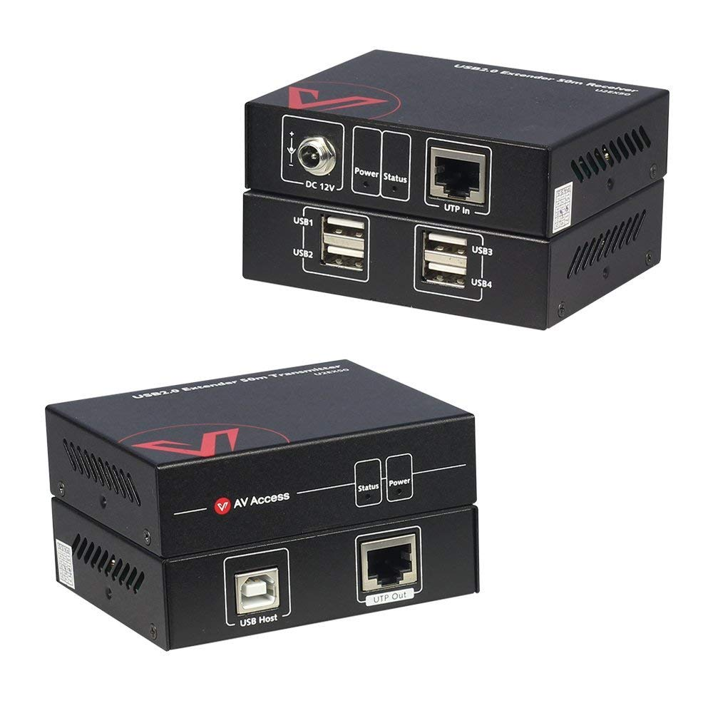

# Equipment Setup

## Overview

The image below gives an overview of all the different components involved and how they play together. It's not exactly to scale though so don't put too much stock into the distance or size of things. Just keep in mind that the rooms are pretty narrow from front to back.

Of the things included in the diagram, we're not responsible for the project, the sound board, or the HDMI cord coming from the presenter's computer. We're responsible for setting everything else up for each of the three rooms.

## Equipment List

Here's a list of all the components we'll have in each room.

- 1 USB webcam
- 1 tripod
- 1 USB over ethernet
- 1 HDMI over ethernet
- 1 HDMI to USB 3.0 capture card
- 1 USB audio interface
- 1 USB 3.0 hub
- 2, 75ft. ethernet cables
- 3 normal length HDMI cables
- 1 short HDMI cable
- 1, 6ft. XLR cable
- 2 power strips
- 3, 25ft. extension cords
- at least one external hard drive
- 1 card table 
- 1 roll of gaffers tape

When running any ethernet or extension cables, consult Todd or Hayden if there's any doubt.

## Recording Table

The card table is set up in the back room next to the sound board. Set up the computer and USB 3.0 hub on this table. We need up to 4 USB ports at a time so the USB hub solves this problem. Other components will also go on this table as different parts of the room are set up.

There are plenty of power outlets in the back of the room, and a couple of the components need direct power. Plug an extension cord and power strip into the closest outlet and situate the power strip as close to the recording table as possible. For starters, the computer will need to be plugged in throughout the day.

## Presenter Feed

One of the most important parts of the presentation is the presenter's slides and example code. So how do we capture that and record it? The venue will already have set up a projector and HDMI cord that goes directly between the projector and the presenter's computer.

### HDMI-ethernet emitter

The HDMI-ethernet emitter goes in between that HDMI cord and the projector. The HDMI-ethernet emitter has HDMI in and out ports on the front. The HDMI cord that's already there goes into the in port. Put an HDMI cord into the emitter's out port and plug the other end into the projector. Plug one of the ethernet cables into the emitter's ethernet port. This ensures that the presenter's feed to the projector is uninterrupted while we get a copy of the same data over the ethernet cable. Run the ethernet cable towards the recording table in the back of the room. (note: the emitter needs to be powered. I'm, thinking we should be able to plug it into the same power outlet as the projector)

### HDMI-ethernet receiver

Place the HDMI-ethernet receiver on the recording table and plug the other end of the ethernet cable into the receiver's ethernet port. The receiver needs to be powered so plug the power adapter into the power strip near the recording table. Plug the short HDMI cable (should be in the box with the HDMI-ethernet extender) into the receiver's HDMI out port.

### HDMI capture card

From there, the short HDMI cord can be plugged into the HDMI capture card, and the USB end of the capture card can be plugged into the USB hub using the included USB 3.0 cord.

## Audio Signal

The audio is pretty straightforward. We'll pick up the audio signal from the sound board over an XLR cable, which will then be plugged into the audio interface.

The audio interface comes with a USB 2.0 cord, which then goes directly into the USB hub. Pretty straightforward.

## Video Feed

The last major element is the video feed of the presenter. We're using USB webcams to record the speakers themselves.

Set this up on the tripod in the front of the room, 10-20 feet from the podium. (We'll get it exact as one of the last setup steps of the morning). Since USB can't go very far itself, we have to extend it over ethernet to the back of the room.

Put the USB-ethernet emitter underneath the camera on the floor somewhere. The emitter does need to be powered so we can run an extension cord from an outlet at the front of the room. From USB-ethernet emitter, run the other ethernet cable to the back of the room to the recording table. Put the USB-ethernet receiver on the table with everything else and plug the other end of the ethernet cable into the receiver. The USB output from the receiver can then be plugged into the USB hub.

## Other Notes
