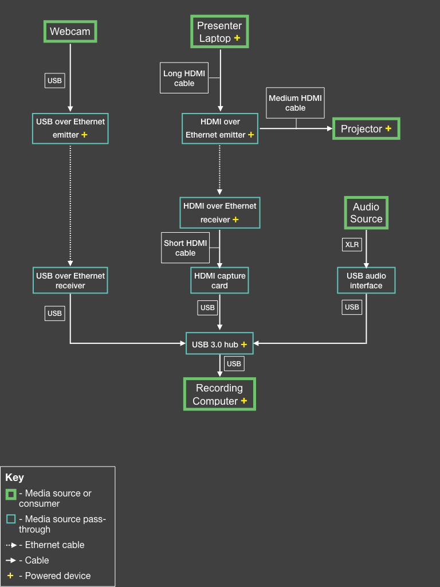

# Equipment Setup

## Overview

The schematic below provides an overview for a typical setup and how all the components play together. 

	

## Equipment List

Here's a list of all the equipment needed

- (1) USB webcam
- (1) tripod
- (1) USB over Ethernet
- (1) HDMI over Ethernet
- (1) HDMI to USB 3.0 capture card
- (1) USB audio interface
- (1) USB 3.0 hub
- (2) 75ft Ethernet cables
- (1) short, 6in - 3ft, HDMI cable
- (1) medium, 3ft - 6ft, HDMI cable
- (1) long, 30ft, HDMI cable
- gaffers tape
- XLR cable(s) as needed
- extension cord(s) as needed
- power strip(s) as needed

## Details

Also, take note of the devices that need to be powered. You'll want to have enough extension cables handy in the case that a power outlet is not easily accessable from the location at which you need to place one of your powered components (i.e. the USB over Ethernet emitter).

After everything is set up, take care to tape down all of your cables with gaffers tape.

### Computer Setup

This setup was designed for recording to take place in the back of the venue to reduce distraction for attendees and more importantly not to impede the presenter.

### Camera Setup

Set up the camera and tripod in a location that gets a good view of the presenter, but does not block attendees' view. If there's an aisle in your venue, that might be a good option. When possible, try not to get too much of the projector screen in the presenter's background.

Another factor that might impact where you place the webcam is access to a power supply. The USB over Ethernet emitter on which the webcam depends is a powered device. Additionally, you'll want to make sure that your Ethernet cable has a clear path 

Keep in mind that you have no view finder so before the event starts, you'll want to have the camera already lined up for where the presenter will be standing. If the presenter likes to walk around (hopefully that's not the case) then you 

## Additional Considerations

### Audio

### Ethernet cables

### HDMI Cables

### Concerns regarding space

### Other concerns

