# OBS Config

Before getting started, please make sure you have the latest version of [OBS installed](https://obsproject.com/download), which is version 23 at the time of this writing.

In the `obs` directory in this repo, you'll find a directory and a json file. You'll be able to import these into OBS to automatically get the right recording settings and input sources, without having to reconfigure everything by hand. So let's get these guys imported!

## Profile

The profile contains all of the recording settings. Let's import that first. Open OBS, and in the toolbar click Profile > Import

	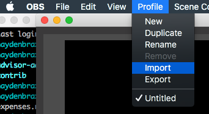

In the dialog that appears, select the `obs/MeetupProfile` from the root of this repository.

	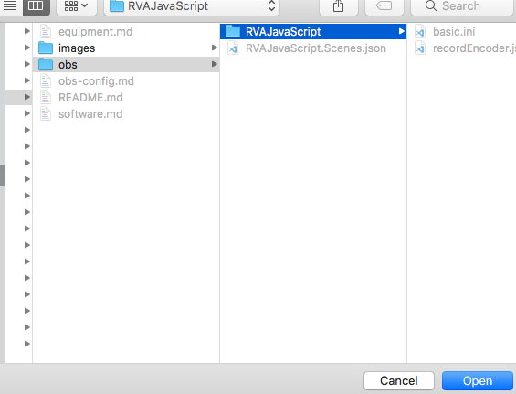

Note that in the case of importing a profile, you're selecting a directory, not a config file. So select that folder, click Open, and it's imported. You could have multiple profiles so make sure that the MeetupProfile profile is selected after importing it.

	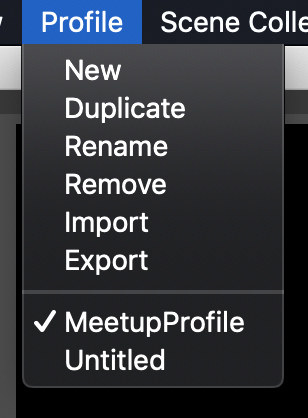

Lastly, as a sanity check, click settings and make sure you see the following:

	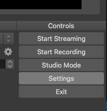

### Output > Recording Settings

	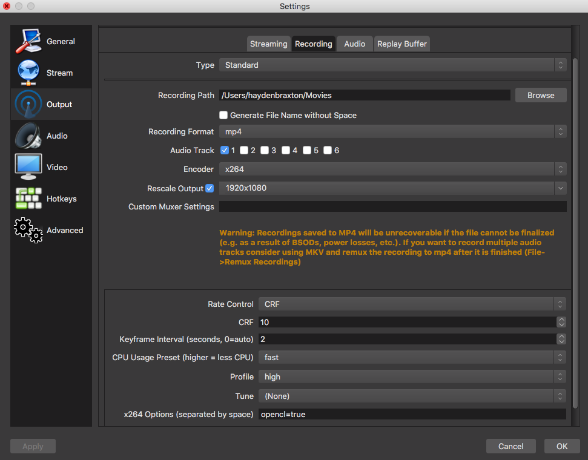

While you're here, make sure you set the Recording Path to wherever you want these files to be recorded on your computer. If you have an external drive hooked up, don't record directly to the external drive. It's best to transfer the fully recorded file to the external drive afterwards.

### Video Settings

	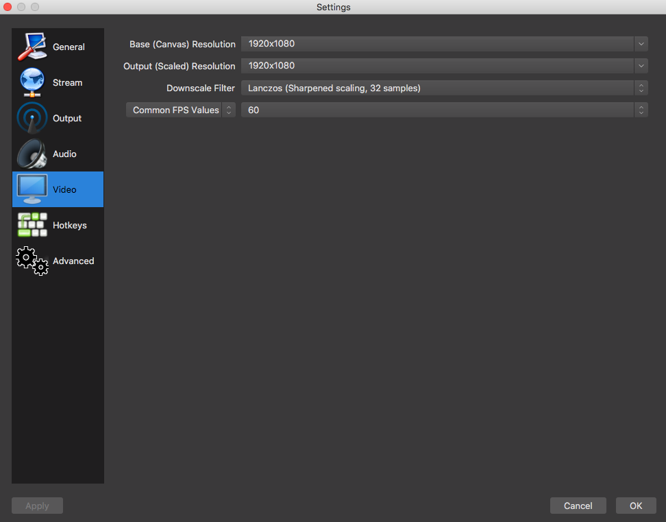

## Scene Collection

Next we import the scene collection so you already have the necessary input sources set up. Similar to importing a Profile, in the toolbar, click on Scene Collection > Import. In the dialog, select `MeetypScenes.json`, which is located in the `obs` directory at the root of this repo.

After importing, make sure you have the MeetupScenes scene collection selected.

	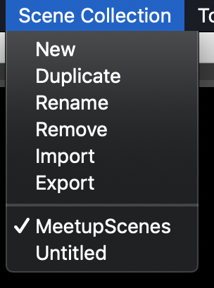

This will only give you a starting point though. You will probably still have to go back through and make sure all of your input sources are configured with the appropriate device or source. Some of these pre-configured sources will not play nicely when plugging in the device or won't let you adjust the settings. If you find this to be the case, you might have to delete the source and re-add it. Let's go through each source ...

	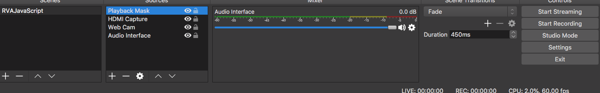

### Playback Mask

To configure the playback mask, select the Playback Mask in the source list, and click on the cog below the window to choose the image for the playback mask.

	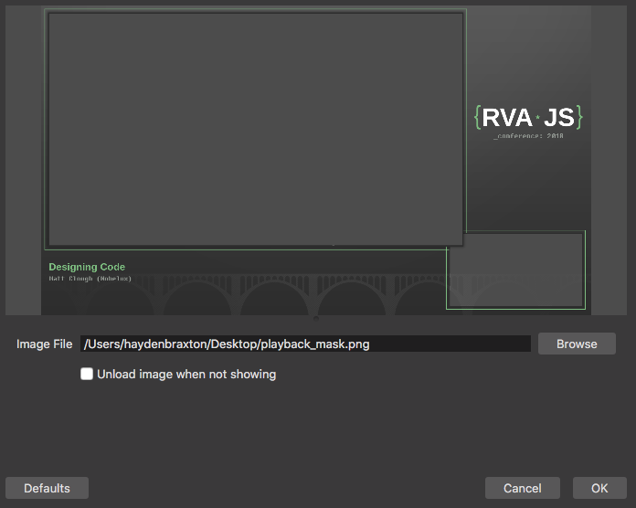

### HDMI Capture

For the HDMI Capture source, open the settings and make sure the are set as follows:

	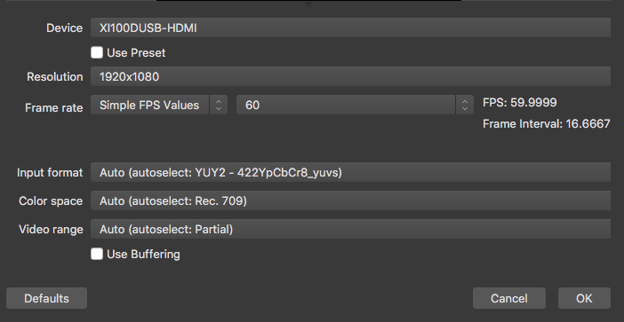

The device name may very, but it will look something like this. It should be pretty apparent. It'll have HDMI in its name. You'll also need to resize this source in the output canvas so that it fits in the big space in the Playback Mask.

### Web Cam

The Web Cam source is pretty similar to the HDMI Capture. Make sure the settings look like this:

	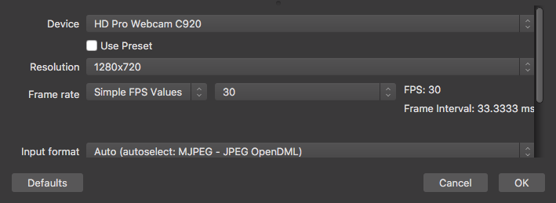

You may or may not have to resize the web cam source on the output canvas. If you do, make sure it fits in the small window in the Playback Mask.

### Audio Interface

The audio interface is pretty straight-forward. Just make sure you have the right device selected.

	

One possible issue with the audio input is sometimes OBS seems to default to the OS audio input rather than the input selected for the audio input source. Make sure to test your audio beforehand. If the audio OBS is picking up is not actually coming from your interface, you'll need to go to System Preferences > Sound > Input, and select the USB Audio CODEC there as well. This doesn't seem to be a problem as of OBS v23 so there shouldn't be any issue here, but do keep this in mind in case you experience set up issues with audio.
