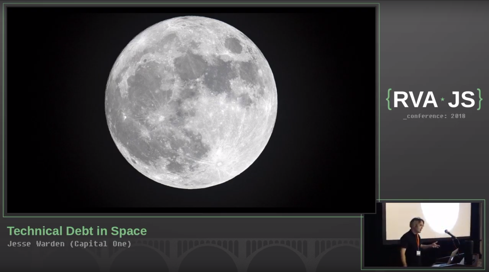

# Playback Mask

The playback mask is an image layer, typically a PNG with transparency, that will overlay the video of the speaker and their slides in the session recording. You can add the playback mask to the recording using OBS, explained in the [OBS config section](./obs-configuration), or after the fact in your video editor, but OBS is the easier option in most cases.

	

In addition to increasing the aesthetic of your recordings, the playback mask adds tactical value as well. You'll probably find that without placing super close to the speaker, they look really small in the video. Similarly, you might not want everything that's in view of the camera to be included in the recording. To solve these problems, rather than sizing the speaker video to the exact size you want it to display in the recording, you can enlarge it so the speaker is more prominent in the video and there's less background distraction, hiding the extra video behind the playback mask. Most webcams these days can deliver 1080p video, so take advantage of that.

With this in mind, get creative and explore different arrangements of the webcam video and slides. Put them in different places. Use the playback mask as a tool to your advantage.

You'll find a very simple playback mask in the root level of this repository. You can use this if you want, but unlike me, you probably have the design skills to make something a little more nicer-looking. You probably also have real design tools, but if not, Preview and Keynote will get you a lot farther than you think 😉.
