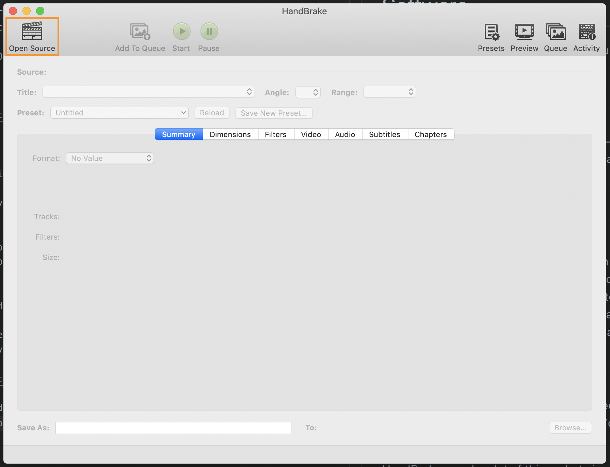
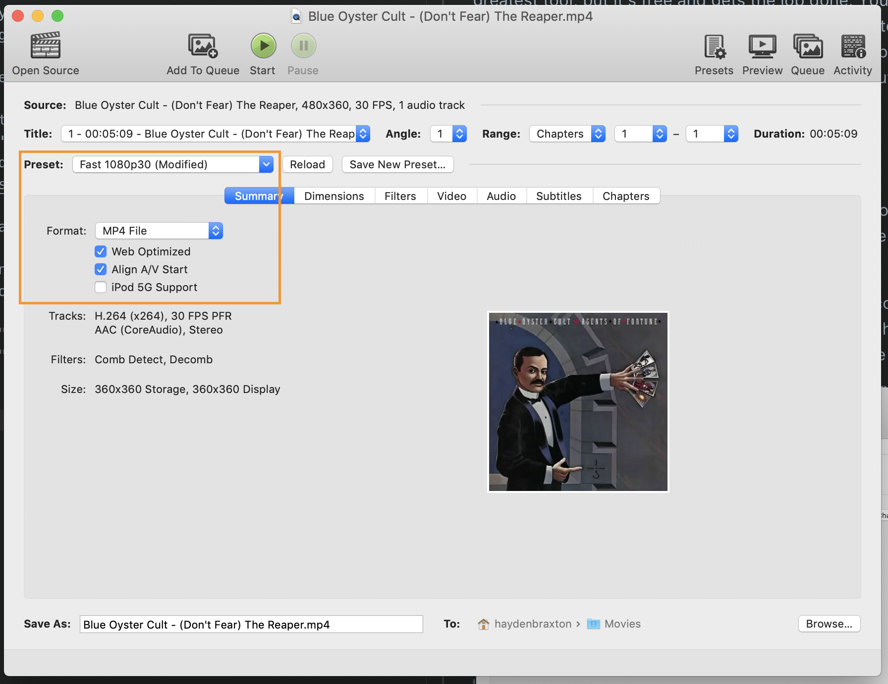

# Software

There's three main pieces of software you'll be using, all of which are free.

## OBS Studio

OBS Studio is a great piece of free / open-source software for recording and streaming. You can download it [here](https://obsproject.com/).

OBS setup is explained [here](./obs-configuration.md).

## iMovie

If you're a Mac user, you'll be familiar with iMovie. It's not the greatest tool, but it's free and gets the job done. You'll want to use iMovie (or whatever video editor your OS supports) to edit your recordings afterward. For each recording, you'll probably want to trim off empty space from the beginning and end, put in a fancy intro, etc.

## HandBrake

After exporting the final version of your recording from iMovie, you'll want to compress it before uploading it. You can use HandBrake for this. You can download HandBrake [here](https://handbrake.fr/).

HandBrake can do a lot of things, but simple video compression is pretty easy. Select "Open Source" from the top left-hand corner, and choose the video file you want to compress from the resulting dialog.

	

From there, HandBrake gives you a lot of levers you can adjust. If you're a video file compression genius, have fun with all of that. The only adjustments I'll make are maybe the preset, and I always check the "Web Optimized" option. That'll get you a pretty well-optimized file for uploading to the web.

HandBrake can only handle on file at a time, so if you have multiple files to compress, you can queue up each compression job and then sit back while HandBrake does its thing.

	

